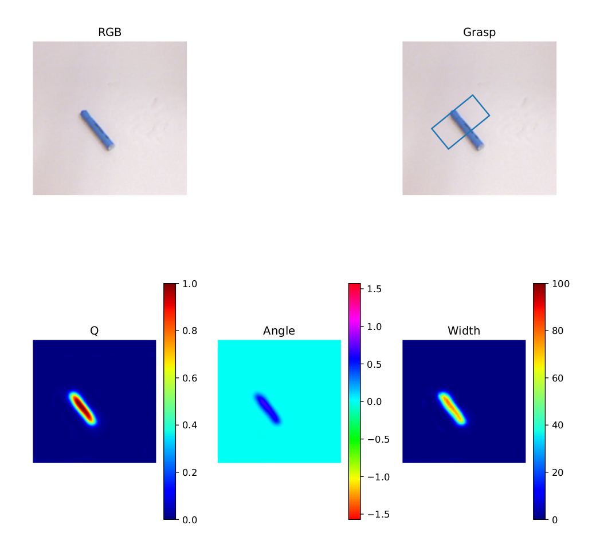
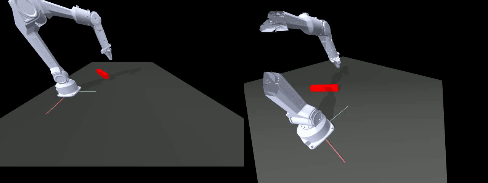

# 深蓝学院 Project 4
# 基于GR-ConvNet的物体检测与机械臂抓取

## 项目介绍

Antipodal Robotic Grasping是一种机器人抓取技术，旨在通过预测和执行反向抓取（antipodal grasp）来提高机器人抓取的稳定性和成功率。

GR-ConvNet是该技术的代表工作之一，这个工作的核心技术是基于生成残差卷积神经网络，结合生成模型和残差网络的优势，更准确地预测物体的抓取点。具体步骤包括：

1. ‌**物体检测**‌：模型首先对摄像头捕捉到的图像进行物体检测，识别出图像中的物体。
2. ‌**抓取点预测**‌：在检测到物体后，模型预测适合该物体的反向抓取点，即两个相对的抓取点，以确保机器人能够稳定地抓取物体。
3. ‌**抓取配置生成**‌：最后，模型生成具体的抓取配置，包括抓取点的位置、角度等信息，供机器人执行抓取任务‌。

该工作的论文下载链接：https://arxiv.org/abs/1909.04810

---

## 你的任务

**Step 1：环境配置**

你可以选择以下两种方式完成本项目的环境配置：

#### 方案一：复用项目一的环境

可以继续使用 Project 2的环境，仅需补充一个缺失包：

```bash
pip install pyrealsense2
```

优点是避免破坏已有环境中对 `numpy`、`torch` 等库的依赖关系。

---

#### 方案二：新建一个专用环境

为本次项目单独创建一个 Conda 环境，推荐使用如下命令：

```bash
conda create -n project4_grcn python=3.9
conda activate project4_grcn
pip install -r requirements.txt
```

`requirements.txt` 中推荐安装的核心依赖包括：

* numpy
* opencv-python
* matplotlib
* scikit-image
* imageio
* torch
* torchvision
* torchsummary
* tensorboardX
* pyrealsense2
* Pillow

---

#### 补充安装：PiPER 机械臂仿真所需依赖（与 Project 2 相同,如果使用其环境则无需安装）

```bash
pip install mujoco==2.3.7 dm_control==1.0.14 ikpy transformations
```

---

### **Step 2：数据集下载与预处理**

本项目使用 [Cornell Grasp 数据集](https://pan.baidu.com/s/1azEF5TAYnKsnfxsv3p_HCQ?pwd=slxy)
提取码：`slxy`

下载后得到压缩包`cornell_grasp.zip`

请将下载好的数据集解压，并放置在你设定的目录中，例如：

```
../cornell_dataset
```

完成后，需将 `.pcd` 文件转换为深度图格式，执行以下命令进行转换：

```bash
python -m utils.dataset_processing.generate_cornell_depth <Path To Dataset>
```

---

## Task 1：基于 GR-ConvNet 实现抓取检测与评估分析

1. 阅读项目结构与inference/models/ `grconvnet.py` 中的 `TODO`，完成 GR-ConvNet 网络结构与前向传播的代码填充。

2. 完成上一步后，运行以下命令进行模型训练：

   ```bash
   python train_network.py --dataset cornell --dataset-path <Path To Dataset> --description training_cornell
   ```

3. 训练完成后，使用以下命令进行模型评估：

   ```bash
   python evaluate.py --network <Path to Trained Network> --dataset cornell --dataset-path <Path to Dataset> --iou-eval
   ```

4. 为了方便调试和结果展示，可对单张图像进行离线推理并生成可视化结果：

   ```bash
   python run_offline.py --network <Path to Trained Network> --rgb_path <Path to png image> --depth_path <Path to tiff depth image>
   ```
在项目目录中已提供一个 .img_result.pdf 文件，展示了训练好的模型对某张图像的抓取推理结果。你可以参考该文件的格式与内容，完成你自己的可视化推理与分析。


5. 选择至少 **3 个不同物体的可视化截图**，保存并加入报告中，并简要分析 **不同物体外形如何影响抓取质量（Grasp Quality）**。

---

## Task 2：集成 GR-ConvNet 与 RRT 实现机械臂仿真抓取

1. 在 `rrt_grcn_grasp.py` 文件中完成 `TODO` 部分的代码，实现从 GR-ConvNet 输出的抓取点转换为 PiPER 机械臂的 RRT 路径规划输入。

2. 完成代码后运行以下命令，结合路径规划与仿真系统实现机械臂抓取任务：

   ```bash
   python rrt_grcn_grasp.py --network <Path to Trained Network>
   ```

3. 程序运行成功后将自动生成抓取动作演示视频 `rrt_grcn_grasp.mp4`，可用于展示机械臂抓取效果。

   


## 作业提交说明

请确保在本项目完成后，提交以下材料(代码如果放在PDF中提交请用格式与正文内容区分)：

1. **完整实现的 `grconvnet.py` 文件**

2. **完整实现的`rrt_grcn_grasp.py`文件**

3. **项目实验报告**
   
   提交pdf文档，内容应包括：
   * **训练过程曲线**：训练 Loss 与验证 IoU 随 Epoch 变化图
   * **评估结果**：使用 `evaluate.py` 得到的性能指标
   * **推理分析**：至少 3 组推理截图，并简要分析

4. **完整的抓取演示视频 `rrt_grcn_grasp.mp4`**

---